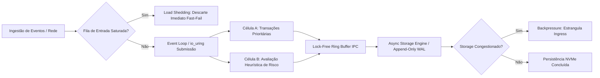

# TRATADO ARQUITETURAL: ENGENHARIA DE SOFTWARE EM HIPERESCALA, SISTEMAS DE MISSÃO CRÍTICA E AUTOMAÇÃO COGNITIVA

---

## 1. EXPOSIÇÃO ESTRUTURAL: A ANATOMIA DE SISTEMAS DE HIPERESCALA (MLOC)

Bases de código que ultrapassam a marca de múltiplos milhões de linhas de código (MLOC — *Million Lines of Code*) comportam-se como ecossistemas biológicos complexos: a alteração em um componente periférico gera ondulações dinâmicas capazes de desestabilizar o núcleo do sistema. Nesses ambientes, a manutenibilidade não decorre da pureza estética do código em nível micro, mas sim da **capacidade de isolamento topológico** entre domínios de execução.

### INFOGRÁFICO: A PIRÂMIDE DA ENTROPIA ARQUITETURAL EM MLOC

```
                   ▲
                  / \     NÍVEL 4: CAMADA FORMAL DE DOMÍNIO
                 /   \    (Regras Estáticas, Invariantes, Zero-I/O)
                /-----\   [Isolamento Matemático / Provas de Não-Regressão]
               /       \
              /         \   NÍVEL 3: MOTORES DE CONCORRÊNCIA E FLUXO
             /           \  (Event-Driven, Shared Memory, Ring Buffers)
            /-------------\ [Desacoplamento Temporal / Sem Contenção de Lock]
           /               \
          /                 \   NÍVEL 2: FRONTEIRAS MODULARES CELULARES
         /                   \  (Células Independentes / APIs C-ABI Rígidas)
        /---------------------\ [Confinamento de Falhas / Hyrum's Law Mitigation]
       /                       \
      /                         \   NÍVEL 1: HARDWARE & KERNEL SUBSYSTEMS
     /                           \  (Drivers, io_uring, Memória Virtual, NIC)
    /-----------------------------\ [Simpatia Mecânica / Alocação Controlada]
```

A sustentabilidade de projetos em hiperescala depende da direção das dependências: **camadas superiores nunca devem ditar o comportamento mecânico das camadas inferiores**, e o fluxo de dados deve ser unidirecional para evitar ciclos de realimentação que impeçam o rastreio analítico de causa raiz.

### MATRIZ COMPARATIVA DE PARADIGMAS DE ARQUITETURA

| Vetor de Engenharia | Sistemas Comerciais de Alta Escala (Web/Big Data) | Sistemas Financeiros de Defesa Antifraude | Aviônica Militar e Defesa Aérea (DO-178C) |
| :--- | :--- | :--- | :--- |
| **Métrica Primária** | Throughput agregado ($RPS$) e elasticidade horizontal. | Latência determinística ($P99.999 < 5\text{ms}$) e consistência estrita. | Pior Tempo de Execução ($WCET$) e ausência absoluta de falhas humanas. |
| **Padrão de I/O** | Assíncrono não-bloqueante (`epoll`, Proatores, *Reactive Streams*). | In-Memory Streaming, Zero-Copy IPC e *Append-Only Logging*. | Time-Triggered Architecture (TTA), barramentos determinísticos (MIL-STD-1553, AFDX). |
| **Gestão de Memória** | Heap dinâmica gerenciada (GC com *pause times* otimizados). | Off-Heap, Ring Buffers estáticos, ponteiros contíguos controlados. | Alocação Estática Total no boot. Proibição de alocação em voo. |
| **Modelo de Isolamento**| Contêineres, Pods, Namespaces e Service Meshes. | Processos isolados em RAM protegida e Enclaves Seguros (SGX). | Particionamento Temporal e Espacial rígido por hardware (ARINC 653). |

---

## 2. PONTO CRÍTICO I (ANÁLITICO-DISSERTATIVO): O COLAPSO DAS ABSTRAÇÕES E O CUSTO OCULTO DA INDIREÇÃO

*Neste ponto de inflexão, desvia-se da mera catalogação descritiva para dissecar a falha epistemológica que acomete grande parte da engenharia de software corporativa: a crença dogmática de que camadas sucessivas de abstração protegem o sistema contra erros.*

Em projetos que atingem a casa dos 10 MLOC, o emprego ingênuo de padrões orientados a objetos — polimorfismo excessivo em tempo de execução, injeção de dependência arbitrária e orquestração de interfaces puramente estéticas — atua paradoxalmente como o principal catalisador do colapso do sistema. A abstração, longe de ser gratuita, cobra seu preço em **tempo de ciclo de instrução de máquina, dispersão de acessos à memória e opacidade comportamental**.


Quando um processador moderno tenta executar uma chamada de método virtual através de múltiplas camadas de indireção, o preditor de desvio (*branch predictor*) é frequentemente incapaz de antecipar o endereço de destino na memória. O resultado é o esvaziamento do pipeline da CPU (*pipeline flush*), forçando o processador a descartar ciclos úteis de processamento enquanto busca a tabela virtual (`vtable`) na memória principal.

Em cenários como a avaliação de fraudes em milissegundos ou o cálculo de superfícies de comando de uma aeronave militar, um atraso causado por um *cache miss* de terceiro nível (L3) ou um ciclo inesperado de coleta de lixo (*Garbage Collection pause*) equivale a uma interrupção material do serviço:

$$\text{Penalidade de Latência} = \text{Latência RAM Ext.} \ (\approx 60\text{ns}) \gg \text{Latência Cache L1} \ (\approx 1\text{ns})$$

A engenharia em hiperescala não pode prescindir do conhecimento das fronteiras do silício. O verdadeiro código limpo em ambientes de alta demanda operacional prioriza a **localidade espacial e temporal dos dados** sobre o desacoplamento formal purista. Modularizar, portanto, não significa fatiar o código em interfaces abstratas invisíveis, mas desenhar fronteiras claras onde os dados transitem em buffers contíguos e onde cada módulo possua responsabilidade determinística sobre o ciclo de vida da sua memória.

---

## 3. MICRO-PROMPT DE OPERAÇÃO RÁPIDA: MODULARIZAÇÃO CIRÚRGICA

*Prompt de disparo único para engenheiros e arquitetos decomporem código denso em módulos desacoplados, com alta coesão e fronteiras estáticas:*

```markdown
# ATUAR COMO: Arquiteto de Sistemas de Alta Confiabilidade e Baixa Latência.
# OBJETIVO: Executar decomposição modular cirúrgica em [CODIGO_FONTE_ORIGINAL], isolando responsabilidades de infraestrutura, lógica de domínio pura e concorrência.

## VARIÁVEIS DE OPERAÇÃO:
- CÓDIGO FONTE A PROCESSAR: [CODIGO_FONTE_ORIGINAL]
- FRONTEIRAS DE DOMÍNIO PRETENDIDAS: [LIMITES_DOMINIO]
- RESTRIÇÕES NÃO-FUNCIONAIS: [RESTRICOES] (Ex: Zero-Allocation no Hot-Path, C-ABI estável, MISRA-Compliant)
- ARQUITETURA ALVO: [MODULARIZACAO_ALVO] (Ex: Ports and Adapters, Cell-Based, Engine Monolítico Modular)

## ALGORITMO DE REESTRUTURAÇÃO (EXECUÇÃO PASSO A PASSO):
1. Mapeie o estado mutável e rastreie o acoplamento temporal (chamadas sequenciais bloqueantes).
2. Isole as funções puras (regras de decisão) de quaisquer efeitos colaterais de I/O e banco de dados.
3. Crie estruturas de dados contíguas para transporte entre as fronteiras, eliminando referências circulares.
4. Empacote as interfaces sob o princípio do menor privilégio: exporte apenas o essencial; oculte os detalhes estruturais.

## SAÍDA ESPERADA:
1. MAPEAMENTO DE FRONTEIRAS: Diagrama de blocos textual demonstrando dependências unidirecionais.
2. CÓDIGO MODULARIZADO: Código refatorado nos módulos definidos, compilável e tipado estritamente.
3. CONTRATO DE INTERFACE: Definição precisa das assinaturas de dados de entrada e saída.
```

---

## 4. EXPOSIÇÃO TÉCNICA: RESILIÊNCIA CONCORRENTE, E/S ASSÍNCRONA E PREVENÇÃO ATIVA

A resiliência em sistemas que gerenciam fluxos críticos reside no tratamento antecipado da **saturação de recursos**. Todo sistema físico possui um limite rígido de capacidade; sistemas que não implementam políticas de rejeição explícita falham catastroficamente por degradação em cadeia.

### FLUXOGRAMA: ROTEAMENTO ASSÍNCRONO COM ISOLAMENTO DE IMPACTO



### Mecanismos de Blindagem de Infraestrutura:
1. **Contrapressão (*Backpressure*) Reativa:** A sobrecarga nos discos de persistência propaga-se de volta ao nó de entrada, reduzindo a janela de recepção de pacotes TCP/QUIC em vez de acumular memória na RAM.
2. **Corte de Carga (*Load Shedding*):** Sob condições extremas onde a capacidade de vazão do sistema é superada, descarta-se o tráfego não essencial na borda em $O(1)$, preservando as transações de alta prioridade em execução.
3. **Muralhas de Contenção (*Bulkheads*):** O esgotamento de threads ou memória no subsistema de relatórios ou auditoria não pode, sob nenhuma hipótese de projeto, subtrair recursos dos núcleos de CPU dedicados ao processamento transacional ou aviônico.

---

## 5. PONTO CRÍTICO II (ANALÍTICO-DISSERTATIVO): A DUALIDADE DA CORREÇÃO — RESOLUÇÃO DE FALHAS SEM DEGRADAÇÃO DE ENTROPIA

*Aprofunda-se aqui a análise sobre a dinâmica de falhas em bases gigantescas. A modificação de um sistema de 10 MLOC para corrigir um defeito latente frequentemente introduz mutações sistêmicas mais graves que o bug original.*

A introdução de correções de emergência em sistemas consolidados é regida pela **Lei de Hyrum**: *com um número suficiente de observadores, não importa o que a especificação de uma interface afirma; qualquer comportamento observável do sistema será utilizado como dependência por alguém*. 

Dessa premissa decorre um axioma fundamental da arquitetura de software: **toda correção de bugs é, por definição, uma alteração que quebra compatibilidade comportamental (*breaking change*)** para alguma fração do ecossistema.

```
                  DINÂMICA DE DEGRADAÇÃO POR CORREÇÃO RÁPIDA
                  
      Defeito Identificado (Incidente em Produção)
                      ↓
   [ Intervenção Pontual / Patch Não-Estruturado ]
                      ↓
   ┌──────────────────────────────────────────────────────────┐
   │ Consequências Imediatas:                                 │
   │  1. Criação de ramificações condicionais ad-hoc (ifs)    │
   │  2. Violação dos invariantes de domínio do módulo        │
   │  3. Acoplamento temporal oculto com callers periféricos  │
   └──────────────────────────────────────────────────────────┘
                      ↓
   [ Aumento da Entropia & Dívida Técnica Criptografada ]
                      ↓
   Nova Falha Sistêmica em Cascata (Surgimento 30 dias após o Patch)
```

A abordagem ingênua diante de uma falha operacional consiste em aplicar remendos sintáticos pontuais — verificações defensivas de nulos, instruções condicionais (*if/else*) aninhadas ou capturas genéricas de exceções. Essa prática assemelha-se à supressão de alarmes de incêndio: remove-se o sintoma enquanto a anomalia fundamental subjacente continua a se propagar pelo estado interno do sistema.

Para corrigir um erro e simultaneamente adicionar novas capacidades (sejam métricas analíticas, novos nós de validação ou suporte a novos protocolos), a intervenção deve operar por **expansão estruturada de tipos e preservação de invariantes**:

1. **Eliminação do Erro no Nível de Tipos:** O sistema deve ser remodelado de modo que o estado de erro torne-se **irreprestável sintaticamente**. Se um ponteiro nulo causou uma falha catastrófica, a estrutura de dados deve ser convertida para tipos seguros por construção (como a mônada `Option`/`Result`), obrigando o compilador a auditar formalmente todos os caminhos de execução.
2. **Propagação Monádica de Falhas:** O tratamento de erros abandona exceções dinâmicas — que violam a linearidade da execução e desestruturam pilhas de chamada — em prol do modelo monádico determinístico. Falhas tornam-se retornos tipados que demandam consumo explícito.
3. **Adição por Enriquecimento de Contrato (Additive Evolution):** A introdução de novas informações deve respeitar a compatibilidade retroativa em nível binário (ABI) e semântico. Modifica-se o invólucro de dados via nós versionados em buffers com alinhamento explícito, sem alterar a ordem dos campos preexistentes, impedindo a invalidação das leituras transacionais em andamento.

---

## 6. MICRO-PROMPT DE OPERAÇÃO RÁPIDA: CORREÇÃO FORENSE CUMULATIVA (FIX + ENRICH)

*Prompt cirúrgico voltado para erradicar causas raiz de bugs em código legado, blindando o sistema e adicionando novas propriedades funcionais sem induzir regressões:*

```markdown
# ATUAR COMO: Engenheiro Forense de Software e Especialista em Confiabilidade de Sistemas Críticos.
# OBJETIVO: Erradicar a falha em [CODIGO_COM_FALHA], injetar os novos elementos de [NOVOS_ELEMENTOS], garantir conformidade com [INVARIANTES_SISTEMA] e aplicar as diretrizes de [SUAS-MELHORIAS].

## VARIÁVEIS DE OPERAÇÃO:
- CÓDIGO AFETADO: [CODIGO_COM_FALHA]
- EVIDÊNCIA DO DEFEITO / STACK TRACE: [RELATORIO_ERRO]
- ELEMENTOS ADICIONAIS A INCORPORAR: [NOVOS_ELEMENTOS] (Ex: Auditoria criptográfica, telemetria eBPF, checagem de limites)
- INVARIANTES INEGOCIÁVEIS: [INVARIANTES_SISTEMA] (Ex: Idempotência estrita, Complexidade Temporal O(1), Zero-Panic)
- MELHORIAS ESPECÍFICAS DO ENGENHEIRO: [SUAS-MELHORIAS]

## ALGORITMO DE INTERVENÇÃO (EXECUÇÃO OBRIGATÓRIA):
1. ANÁLISE DE CAUSA RAIZ: Rastreie a precondição não atendida que permitiu a manifestação de [RELATORIO_ERRO].
2. MODELAGEM PREVENTIVA: Redesenhe a assinatura dos dados para que o estado de erro seja rejeitado em compilação.
3. ENRIQUECIMENTO SEGURO: Integre [NOVOS_ELEMENTOS] e as regras de [SUAS-MELHORIAS] sem adicionar alocações dinâmicas no caminho crítico.
4. PROVA DE INVARIÂNCIA: Demonstre formalmente que [INVARIANTES_SISTEMA] permanecem inviolados após a injeção.

## FORMATO DE SAÍDA:
1. DIAGNÓSTICO ETIOLÓGICO: Explicação técnica da falha na camada de memória, concorrência ou I/O.
2. CÓDIGO CORRIGIDO E EXPANDIDO: Implementação completa, robusta, sem reticências ou omissões.
3. PROVA DE REGRESSÃO ZERO: Testes determinísticos de asserção que cobrem a falha original e os novos elementos.
```

---

## 7. SÍNTESE DA ENGENHARIA DE SISTEMAS INABALÁVEIS

A confiabilidade não é uma propriedade que possa ser inserida a posteriori em um sistema por meio de testes extensivos ou camadas adicionais de orquestração; ela é o resultado direto da **simplicidade deliberada de seus mecanismos fundamentais**. 

Seja nos núcleos de liquidação que processam trilhões de dólares sob ataques sofisticados de agentes maliciosos, seja nas unidades de controle de computadores de bordo que operam aeronaves em condições atmosféricas extremas, os princípios da computação de alta densidade permanecem invariantes:

```
                            O CICLO DA RESILIÊNCIA TOTAL
                            
                         ┌──────────────────────────────┐
                         │    1. Restrição Estática     │
                         │ (Tipagem Firme e Provas AOT) │
                         └──────────────┬───────────────┘
                                        │
                                        ▼
                         ┌──────────────────────────────┐
                         │   2. Simpatia Mecânica       │
                         │ (Cache Locality e Zero-Copy) │
                         └──────────────┬───────────────┘
                                        │
                                        ▼
                         ┌──────────────────────────────┐
                         │   3. Isolamento Celular      │
                         │ (Fronteiras e Sem Contenção) │
                         └──────────────┬───────────────┘
                                        │
                                        ▼
                         ┌──────────────────────────────┐
                         │ 4. Determinismo Concorrente  │
                         │ (Bounded Loops e Fast-Fail)  │
                         └──────────────────────────────┘
```

Em última análise, a maturidade de um ecossistema de software não é atestada pelo volume de ferramentas auxiliares que ele acumula, mas pelo rigor com que rejeita a complexidade acidental, confiando no poder de abstrações seguras e estruturas de dados matematicamente comprovadas.
```
